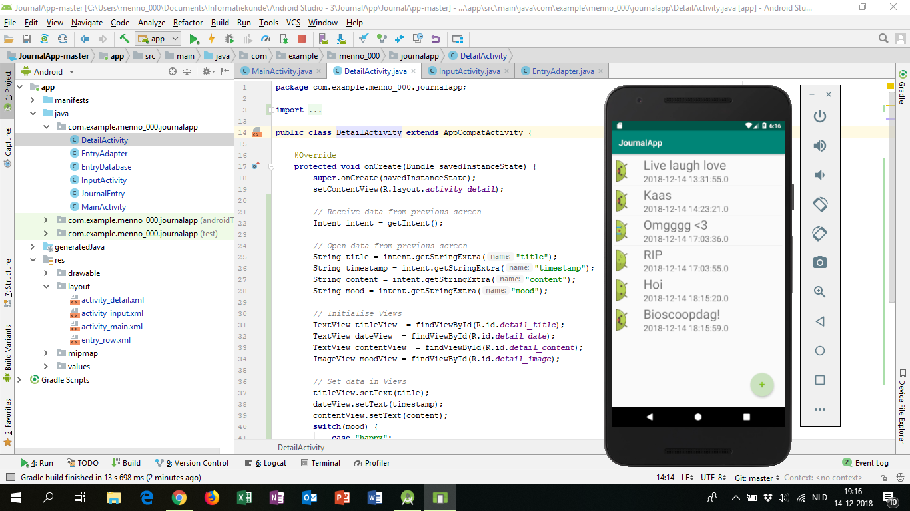

# JournalApp
### Project voor het vak Native App Studio
#### Menno Lont - 11061200

Deze week heb ik de journal app gemaakt met Android Studio.  

Naast de basis functionaliteit heb ik ervoor gezorgd dat journals aangepast kunnen worden. Wanneer een gebruiker op de detailpagina is kan deze een 'edit' knop indrukken waardoor er een nieuwe inputpagina geopend wordt waar de data van de journal die wordt aangepast in staat.

